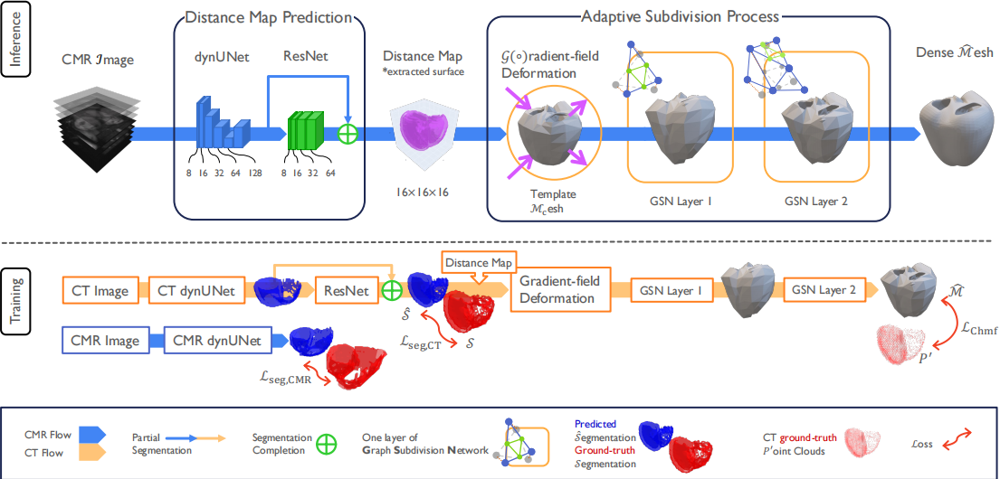

# MorphiNet: A Graph Subdivision Network for Adaptive Bi-ventricle Surface Reconstruction



## Introduction

**MorphiNet** is a novel network that reproduces heart anatomy learned from high-resolution Computed Tomography (CT) images, unpaired with Cardiac Magnetic Resonance (CMR) images. It addresses the limitations of CMR imaging—anisotropy, large inter-slice distances, and misalignments—by encoding anatomical structure as gradient fields that deform template meshes into patient-specific geometries.

A multilayer graph subdivision network (GSN) refines these geometries while maintaining dense point correspondence, suitable for computational analysis. MorphiNet achieves state-of-the-art bi-ventricular myocardium reconstruction and delivers 50× faster inference than comparable neural implicit function methods.

For more details, please refer to the published [IEEE TMI paper](https://doi.org/10.1109/TMI.2026.3683925) or the [arXiv preprint](https://arxiv.org/abs/2412.10985).

## Environment Preparation

You can set up the required environment using Conda. We provide a helper script and an environment configuration file.

### Prerequisites
- Linux
- NVIDIA GPU with CUDA support (CUDA 11.8 recommended)
- Conda

### Installation

1.  **Clone the repository:**
    ```bash
    git clone https://github.com/MalikTeng/MorphiNetV2.git
    cd MorphiNet
    ```

2.  **Create and activate the environment:**
    You can use the provided installation script which sets up the conda environment and installs additional dependencies (like PyTorch Geometric extensions):
    ```bash
    bash install_morphinet.sh
    conda activate morphinet
    ```

    Alternatively, manually create the environment from `environment.yml`:
    ```bash
    conda env create -f environment.yml
    conda activate morphinet
    ```


## Path Configuration

MorphiNet reads project-specific runtime paths from `config.env` and helper shell scripts read Conda settings from `conda.env`. Both files are plain shell-compatible `KEY=VALUE` files and are safe to edit for your machine.

Default paths are project-relative so a checkout can run without user-specific absolute directories:

```bash
# config.env
export MORPHINET_ACDC_DATA_DIR="./dataset/Dataset021_ACDC"
export MORPHINET_MMWHS_DATA_DIR="./dataset/Dataset022_MMWHS_CT"
export MORPHINET_CAP_DATA_DIR="./dataset/Dataset011_CAP_SAX"
export MORPHINET_SCOTHEART_DATA_DIR="./dataset/Dataset020_SCOTHEART"
export MORPHINET_CKPT_DIR="./checkpoints"
export MORPHINET_USE_CKPT="./pretrained"
export MORPHINET_OUTPUT_ROOT="./results"
```

```bash
# conda.env
export CONDA_ROOT="${HOME}/miniconda3"
export CONDA_ENV_NAME="morphinet"
```

For the default CLI commands, place or symlink raw datasets under `./dataset/` using the directory names above. The JSON split files remain in `./dataset/*.json`; the raw image roots should contain their expected `imagesTr`/`labelsTr` or `imagesTs`/`labelsTs` subdirectories. Put downloaded pretrained weights in `./pretrained/`, training checkpoints in `./checkpoints/`, and inference exports will be written under `./results/` unless overridden.

Every value can also be overridden for one command without editing files:

```bash
MORPHINET_ACDC_DATA_DIR=/data/Dataset021_ACDC \
MORPHINET_OUTPUT_ROOT=/scratch/morphinet-results \
python main.py --inference_only --test_dataset acdc
```

CLI flags such as `--ct_data_dir`, `--mr_data_dir`, `--use_ckpt`, `--ckpt_dir`, and `--output_root` still take precedence when provided explicitly.


## External Resources

> [!IMPORTANT]
> Use the resource files from the latest release (**v1.0.1**) so the checkpoints, template meshes, orientation anchor, and code stay in sync.

Download the assets from the latest [GitHub Release](https://github.com/MalikTeng/MorphiNetV2/releases/latest) and extract them from the repository root:

```bash
# From the repository root — pretrained weights and template meshes
for a in morphinet-pretrained.tar.gz morphinet-template.tar.gz; do
    curl -L -o "$a" "https://github.com/MalikTeng/MorphiNetV2/releases/latest/download/$a"
    tar -xzf "$a" && rm "$a"
done
```

The checkpoint archive should create `./pretrained/` with:

```
pretrained/
├── best_UNet_CT.pth
├── best_UNet_MR.pth
├── best_ResNet.pth
├── best_GSN.pth
├── best_subdivided_faces_l0.pth
└── best_subdivided_faces_l1.pth
```

The template archive should create `./template/` with:

```
template/
├── faces-control_mesh.txt
├── template_mesh-lv_myo.obj
├── template_mesh-myo.obj
└── verts-control_mesh.txt
```

The default `config.env` points `MORPHINET_USE_CKPT` to `./pretrained`, and `main.py` uses `./template/template_mesh-myo.obj` as the default template mesh. No extra path changes are needed if these folders are extracted at the repository root.

### Orientation anchor (for the alignment helper)

The orientation alignment helper [`tools/align_orientation.ipynb`](tools/align_orientation.ipynb) needs an **anchor** image/label, also bundled in the latest release. Download both files into `./template/`:

```bash
# From the repository root
curl -L -o template/acdc_anchor_image.nii.gz \
    https://github.com/MalikTeng/MorphiNetV2/releases/latest/download/acdc_anchor_image.nii.gz
curl -L -o template/acdc_anchor_label.nii.gz \
    https://github.com/MalikTeng/MorphiNetV2/releases/latest/download/acdc_anchor_label.nii.gz
```

## Dataset Preparation


MorphiNet uses JSON files to manage dataset splits and file paths. These files are located in the `dataset/` directory. Raw datasets are also expected under `./dataset/` by default, with configurable roots in `config.env`.

> [!IMPORTANT]
> **Correct data orientation is required.** MorphiNet deforms the template mesh with a gradient field derived from the segmentation, so every dataset must be in the orientation the pipeline expects — a mis-oriented dataset silently yields wrong reconstructions. Before training or inference on a new dataset, use the interactive helper [`tools/align_orientation.ipynb`](tools/align_orientation.ipynb) to align your segmentation to the provided anchor and write the corrected NIfTI files into the MorphiNet layout (see [`tools/README.md`](tools/README.md)).

### Structure
The expected data structure involves:
1.  **Raw Data**: Your CT and MR images stored in specific directories.
2.  **Index Files**: JSON files (e.g., `dataset_task20_f0.json`) that map case IDs to their file paths.

### Configuration
When running the training script, use `config.env` for default raw data roots or override them on the CLI:
- `--ct_data_dir`: Root directory for CT data.
- `--ct_json_dir`: Path to the CT dataset JSON.
- `--mr_data_dir`: Root directory for MR data.
- `--mr_json_dir`: Path to the MR dataset JSON.

**Note**: You can generate or update these JSON files using the utility script provided in `utils/update_dataset_json.py`.

## Usage

MorphiNet supports both training (end-to-end curriculum learning) and inference.

### Training

To start the training pipeline, run `main.py`. The training proceeds in three phases:
1.  **UNet**: Segmentation training.
2.  **ResNet**: Distance field prediction.
3.  **GSN**: Graph Subdivision Network for mesh refinement.

```bash
python main.py \
    --mode online \
    --ct_data_dir /path/to/ct_data \
    --mr_data_dir /path/to/mr_data \
    --max_epochs 100 \
    --batch_size 1
```

**Key Arguments:**
- `--mode`: Setup W&B mode (`online`, `offline`, `disabled`).
- `--max_epochs`: Total number of training epochs.
- `--pretrain_epochs`: Epochs for UNet pre-training.
- `--train_epochs`: Epochs for ResNet training.
- `--batch_size`: Batch size (default: 1).
- `--lr`: Learning rate (default: 1e-3).
- `--use_ckpt`: Path to resume training from a specific checkpoint. Defaults to `MORPHINET_USE_CKPT` from `config.env`.

### Testing / Inference

To test a trained model on a specific dataset (e.g., ACDC, MMWHS, CAP):

```bash
python main.py \
    --inference_only \
    --test_dataset acdc \
    --use_ckpt /path/to/checkpoint/dir
```

**Key Arguments:**
- `--inference_only`: Flag to enable inference mode.
- `--test_dataset`: Target dataset (`acdc`, `mmwhs`, `cap`, `scotheart`).
- `--output_root`: Directory to save exported meshes and results. Defaults to `MORPHINET_OUTPUT_ROOT` from `config.env` (`./results`).

## Codebase Structure

The codebase is organized into modular components:

```
MorphiNet/
├── dataset/            # JSON files defining dataset splits
├── environment.yml     # Conda environment configuration
├── install_morphinet.sh # Installation helper script
├── main.py             # Main entry point for training and testing
├── run.py              # Factory for creating training/inference pipelines
├── evaluation/         # Metrics and evaluation logic
├── model/              # Neural network architectures
│   ├── networks.py     # Definitions of UNet, ResNet, and GSN
│   ├── parts.py        # Building blocks for networks
│   ├── mesh_operations.py # Differentiable mesh operations
│   └── inference.py    # Inference-specific logic
├── pipeline/           # Core pipeline orchestration
│   ├── orchestrator.py # Manages the training phases (UNet -> ResNet -> GSN)
│   └── testing.py      # Testing pipeline logic
├── training/           # Training components
│   ├── trainer.py      # Training loop implementation
│   ├── validators.py   # Validation logic during training
│   └── losses.py       # Loss functions (Chamfer, Laplacian, etc.)
└── utils/              # Helper utilities
    ├── mesh_metrics.py # Geometric metrics calculation
    ├── process_nrrd_slices.py # Data processing tools
    └── update_dataset_json.py # Dataset index generator
```

## Citation

If you find this work useful in your research, please cite the published IEEE TMI paper:

```bibtex
@article{deng2026morphinet,
  author = {Deng, Yu and Xu, Yiyang and Qian, Linglong and Mauger, Charlene and Nasopoulou, Anastasia and Williams, Steven and Williams, Michelle and Niederer, Steven and Newby, David and McCulloch, Andrew and Omens, Jeff and Pushprajah, Kuberan and Young, Alistair},
  title = {MorphiNet: A Graph Subdivision Network for Adaptive Bi-ventricle Surface Reconstruction},
  journal = {IEEE Transactions on Medical Imaging},
  year = {2026},
  pages = {1--1},
  doi = {10.1109/TMI.2026.3683925},
  note = {Early Access}
}
```
